# Architecture Overview (English)

## Page 1 – Project Scope & Output

### 1. Project Goal

The goal is to extract jobs from each company’s ATS careers page (for ~65 companies) based on the input workbook and export them into standardized CSV files.
The pipeline should be reproducible (same input → same output schema), robust to partial failures (one company may fail without breaking the run), and the exported data should reflect what is visible in the ATS as accurately as possible.

### 2. Inputs

`master_companies_with_fingerprint.xlsx` with columns:
- `company`
- `ats_url`
- `ats_type`

### 3. Output

A standardized CSV file with the following columns:
- `company`
- `job_title`
- `location`
- `job_url`
- `job_id` (if the ATS provides it)
- `posted_date` (if the ATS provides it)

Note on `status`:
- A status field like `new | open | closed` derived by comparing job IDs to the previous run is a **future improvement** and is intentionally not implemented in the current pipeline.

Note on `job_id`:
- Internally, `job_id` is part of the standardized record. If an ATS does not expose a stable job ID, the scraper may leave it empty.
- If needed for a one-off delivery, missing `job_id` values can be filled manually, and the mapping can be improved in a later iteration.

### 4. Constraints

Source constraints
1. Not all companies use the same ATS/API (Workday/Oracle/SAP/Greenhouse/custom pages → different endpoints/HTML/JS). Constraint: heterogeneous sources / no standard API interface.
2. APIs are not always available or stable (some are HTML-only, some hide IDs, some block). Constraint: not every source offers a public, reliable API.
3. The data is often not present in the initial HTML but is loaded later via JavaScript (JS-heavy sites).
4. A Singapore filter is not consistently available or reliable across all ATS tenants. Constraint: explicit location validation per job, often tenant-specific.

Operational constraints
5. Anti-bot / captchas / rate limits (e.g., practical limit like ~10 requests/second).
6. Job IDs are not always available. Stable identifiers are not guaranteed → may require derived IDs/hashes as a future enhancement.

### 5. Non-Goals

- No UI
- No database (except optional run report / CSV diff artifacts)
- No login/session bypass, no CAPTCHA bypass
- No “100% completeness guarantee” for sites that block access (produce a report instead)

### How to run

```bash
python -m pip install -r requirements.txt
python -m playwright install chromium
python -m src.runners.run_batch3 

```


## Page 2 – Internal Core Model

### 1. JobRecord (internal standard format)

A `JobRecord` is a Python dict with the following keys.

Required keys:
- `company`: str
- `job_title`: str
- `location`: str
- `job_id`: str
- `posted_date`: str | null (ISO format `YYYY-MM-DD` preferred)
- `job_url`: str

Optional (internal/debug only):
- `source`: str (e.g. `"oracle"`)
- `scraped_at`: str (ISO timestamp)
- `raw`: object (original ATS response for debugging)

Rule:
- All collectors return: `List[JobRecord]`
- The exporter writes only the required keys to CSV.

## Page 3 – Modules

State 0: Preparation (input data)

State 1: Load input – module: **io/loaders.py**
1. Read companies input
2. Normalize columns (e.g., `Company` vs `company`)
3. Each row becomes a CompanyItem (one company + metadata)
Output of this state: `List[CompanyItem]`

Example:

		companies = [
		{ company: "A", ats_type: "oracle", url: "...", ... },
		{ company: "B", ats_type: "workday", url: "...", ... },
		...
		]

State 2: Collector resolution (orchestration step) – **runners/run_batchX.py**, **collectors/registry.py**

				ATS_COLLECTORS = {
				"oracle": OracleCollector,
				"workday": WorkdayCollector,
				}

		collector_cls = ATS_COLLECTORS[company.ats_type]
		collector = collector_cls(config, http_client)

State 3: Collect (fetch raw data) – **collectors/collectorX.py**
The collector:
- builds request(s)
- paginates (offset/limit)
- fetches responses (JSON/HTML)
- accumulates raw jobs
Output: `raw_jobs` (ATS-specific)

State 4: Parse + map to standard format – **collectors/collectorX.py**
- raw ATS objects → `JobRecord` (standard)
- field mapping (`job_id`, `title`, `posted_date`, …)
Output: `List[JobRecord]` (standardized)

State 5: Normalize – **core/normalize.py**
- normalize dates
- clean locations
- trim strings
- standardize missing values (e.g., `""` instead of `None`)
Output: `List[JobRecord]` (clean)

State 6: Validate – **core/validators.py**
- is `job_title` non-empty?
- is `job_url` present?
- is `posted_date` parseable (or empty allowed)?
- can `job_id` be empty for this ATS?
Output: `valid_records`, `validation_errors`
`ValidationError` contains: `company`, `job_id`, `field`, `reason`, `severity`

Example severity:
- `severity="ERROR"` for missing `job_url`
- `severity="WARNING"` for missing `posted_date`

Example:

		JobRecord(
				company="ACME",
				job_title="Software Engineer",
				job_url="https://...",
				posted_date="2024-01-05",
				job_id="123"
		)

		ValidationError(
				company="ACME",
				job_id="123",
				field="job_url",
				reason="missing"
		)

State 7: Dedupe + merge – **core/dedupe.py**
- remove duplicates (key e.g. `company + job_id`)
- merge records from all companies
Output: `final_records: List[JobRecord]`
Key rules:
- if `job_id` exists: key = `company|job_id`
- otherwise: key = `company|job_url` (or `company|title|job_url`)

State 8: Export + report – **io/exporter.py (CSV)**, **io/reporting.py (JSON/MD)**
Input:
- `final_records: List[JobRecord]` (deduped, validated)
- `validation_errors: List[ValidationError]` (collected in state 6)
Output:
- Report `batchx_report.json`
- `batchx_jobs.csv`

Example report (JSON)

```json
{
	"generated_at": "2025-12-31T09:48:17Z",
	"ats": "tribepad",
	"companies": {
		"total_loaded": 61,
		"selected": 1,
		"per_company_job_counts_after_dedupe": {}
	},
	"records": {
		"before_dedupe": 0,
		"after_dedupe": 0
	},
	"validation": {
		"total": 0,
		"missing": {
			"company": 0,
			"job_title": 0,
			"job_id": 0,
			"job_url": 0,
			"posted_date": 0,
			"location": 0
		},
		"bad_date_format": 0,
		"duplicates_company_jobid": 0
	}
}
```

## Page 4 – Pipeline

Prepare → Load → ResolveCollector → Collect → Map → Normalize → Validate → Dedupe → Export+Report

## Page 5 – Flowchart

```mermaid
flowchart TB
	Z0["Status quo (Input-Data)"]

	%% Z1
	Z1h["io/loaders.py"]
	Z1["Load input:
1. Read companies input
2. Normalize columns
3. 1 row = 1 Company-Item (metadata)
Output: List<CompanyItem>"]

	%% Z2
	Z2h["runners/run_batchX.py + collectors/registry.py"]
	Z2["Collector resolution (orchestration)
	Output registry: Str
	"]
  

	%% Z3
	Z3h["collectors/collectorX.py"]
	Z3["Collect (fetch data):
- build request(s)
- paginate (offset/limit)
- fetch responses (JSON)
- accumulate raw jobs
Output: raw_jobs (ATS-specific)"]

	%% Z4
	Z4h["collectors/collectorX.py"]
	Z4["Parse + map to standard format:
- raw ATS objects → JobRecord (standard)
- field mapping (job_id, title, posted_date, …)
Output: List<JobRecord> (standardized)"]

	%% Z5
	Z5h["core/normalize.py"]
	Z5["Normalize:
- normalize dates
- clean locations
- trim strings
- standardize missing values (e.g. empty string instead of None)
Output: List<JobRecord> (clean)"]

	%% Z6
	Z6h["core/validators.py"]
	Z6["Validate:
- job_title non-empty?
- job_url present?
- posted_date parseable or empty allowed?
- job_id empty allowed?
Output: valid_records, validation_errors
ValidationError: company, job_id, field, reason, severity"]

	%% Z7
	Z7h["core/dedupe.py"]
	Z7["Dedupe + merge:
- remove duplicates (key e.g. company + job_id)
- merge records from all companies
Output: final_records: List<JobRecord>
Key:
- if job_id exists: company|job_id
- else: company|job_url (or company|title|job_url)"]

	%% Z8
	Z8h["io/exporter.py (CSV) + io/reporting.py (JSON/MD)"]
	Z8["Export + report:
Input:
- final_records: List<JobRecord>
- validation_errors: List<ValidationError>
Output:
- batchx_report.json
- batchx_jobs.csv"]

	%% Flow
	Z0 --> Z1h --> Z1 --> Z2h --> Z2 --> Z3h --> Z3 --> Z4h --> Z4 --> Z5h --> Z5 --> Z6h --> Z6 --> Z7h --> Z7 --> Z8h --> Z8

	%% Styling: header nodes red
	classDef header fill:#ffdddd,stroke:#cc0000,color:#cc0000
	class Z1h,Z2h,Z3h,Z4h,Z5h,Z6h,Z7h,Z8h header
```



## Page 6 – New ATS types

For new ATS types (generic/branded/custom/etc.), you do not need to rebuild the entire vertical stack each time.
In practice you mainly:
1. add a new collector
2. extend the registry
3. optionally adjust Normalize/Validate/Dedupe if the new ATS delivers special fields

Everything else remains the same.

